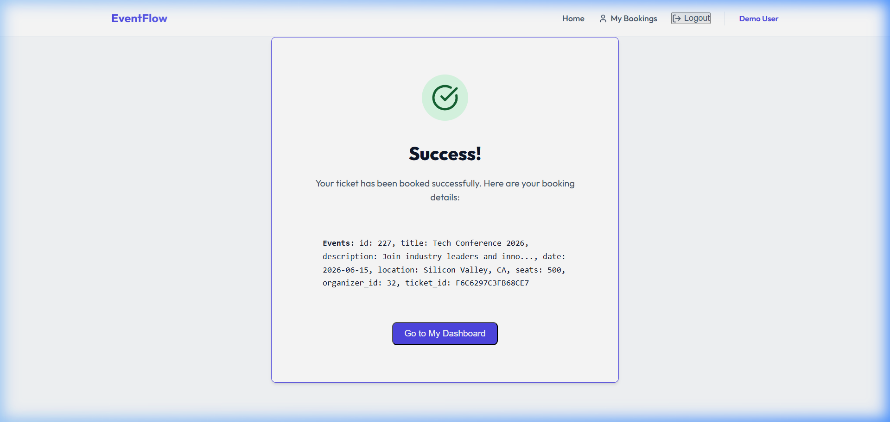
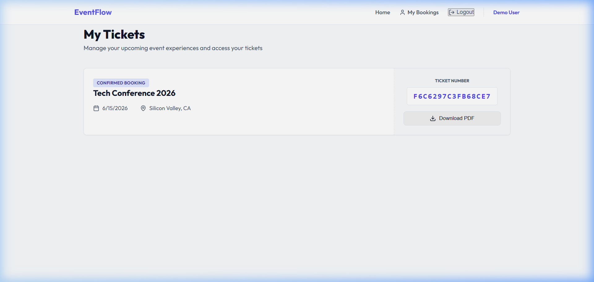
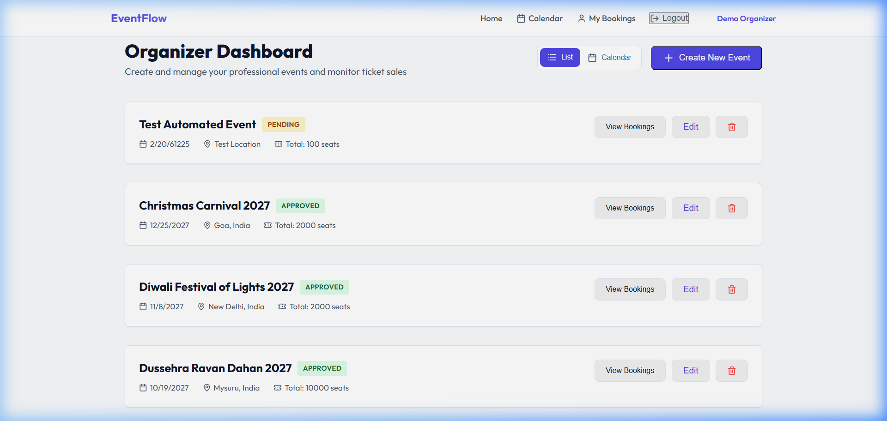
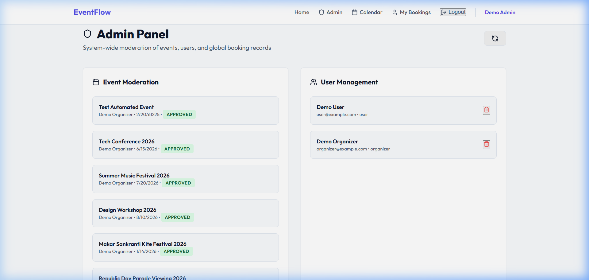
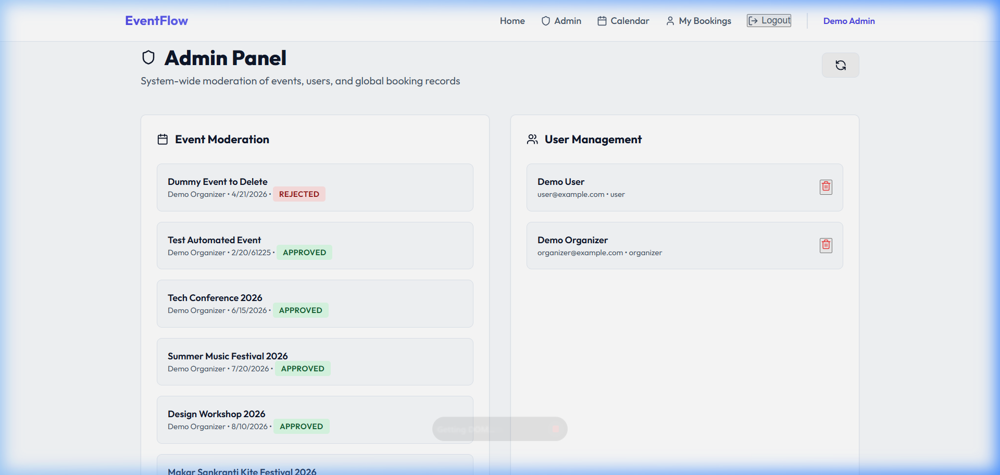

# Online Event Booking and Management System

This project is a comprehensive event booking and management platform with distinct roles for Users, Organizers, and Admins.

## 🚀 Getting Started

Follow these steps to set up and run the project locally on your machine.

### 1. Clone the Repository
```bash
git clone <YOUR_GITHUB_REPO_URL>
cd "Online Event Booking and Management"
```

### 2. Setup Backend
1. Open a terminal and navigate to the backend folder:
   ```bash
   cd backend
   ```
2. Install dependencies:
   ```bash
   npm install
   ```
3. Start the server:
   ```bash
   node server.js
   ```

### 3. Setup Frontend
1. Open a **new** terminal and navigate to the frontend folder:
   ```bash
   cd frontend
   ```
2. Install dependencies:
   ```bash
   npm install
   ```
3. Start the development server:
   ```bash
   npm run dev
   ```
4. Open the application at the URL provided in the terminal (usually `http://localhost:5173`).

---

## 🎥 Full Testing Recording
Below is the complete recording of the automated testing session:


---

## 👤 User Role: Booking an Event
**Objective:** Log in as a user, book an event, and verify it in the dashboard.




**Result:** Successfully booked "Tech Conference 2026" and confirmed it appeared in the "My Bookings" list.

---

## 🏢 Organizer Role: Creating an Event
**Objective:** Log in as an organizer and create a new event.



**Result:** Created "Test Automated Event". The event was successfully added to the organizer's dashboard with a **PENDING** status.

---

## 🛠️ Admin Role: Approval & Deletion
**Objective:** Log in as an admin to approve pending events and delete/reject events.




**Result:**
1.  **Approval:** The "Test Automated Event" created by the organizer was approved.
2.  **Deletion:** A dummy event was successfully deleted (rejected) from the moderation queue.

---

## ✅ Final Status
- **User Flow:** Working as expected.
- **Organizer Flow:** Working as expected.
- **Admin Flow:** Working as expected.
- **Strict Constraint:** No code changes were made; only testing was performed.
